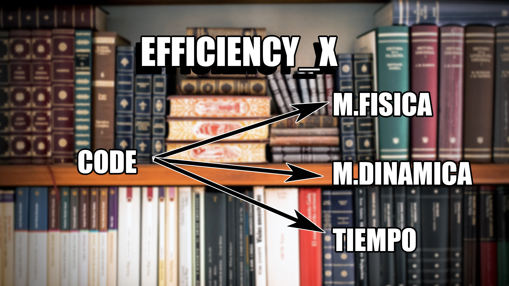
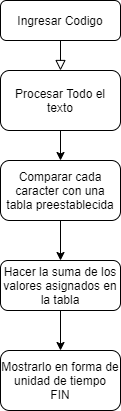

<h1 align="center"> 💻Efficiency_X </h1>

<div align="center">

 </div>

<h1 align="center"> Diagrama </h1>

<div align="center">

 </div>


## Pruebas.
```Pascal
var
	caracter:char;
	numero: integer;
	numero : INTEGER;
	r:real;
	bool:boolean;
	puntero: ^integer;
	puntero2:^char;
	puntero:^real;
	puntero:^boolean;
begin
end.
```


## Codigo de prueba.

```Pas
program Problema;
type
  cadena35 = string[35];
  empleado = record
    dirCorreo: cadena35;
    edad: integer;
    sueldo:real;
  end:
  
  punt = empleado^;
  vector = array [1..500] of punt;
  
  lista = ^nodo;
  nodo = record
    dato: empleado;
    sig: lista;
  end;
  
var
	caracter:char;
	numero: integer;
	numero : INTEGER;
	r:real;
	bool:boolean;
	puntero: ^integer;
	puntero2:^char;
	puntero:^real;
	puntero:^boolean;
begin

  l:=nil;
  for i:=1 to 10 to 
  begin
    read(emp.dirCorreo, emp.edad, emp.sueldo);
    if (emp.edad < 40) and (emp.sueldo < 40000) then
      exp.sueldo:= exp.sueldo + 7000;
    new(aux); 
    aux^.dato := emp;
    aux^.sig: := l;
    l := aux;    
  end;
end.

```


## Agregando strings.

```Pascal
program Problema;
type
  cadena35 = string[35];
  empleado = record
    dirCorreo: cadena35;
    edad: integer;
    sueldo:real;
  end:
  
  punt = empleado^;
  vector = array [1..500] of punt;
  
  lista = ^nodo;
  nodo = record
    dato: empleado;
    sig: lista;
  end;
  
var
	caracter:char;
	numero: integer;
	numero : INTEGER;
	r:real;
	bool:boolean;
	puntero: ^integer;
	puntero2:^char;
	puntero:^real;
	puntero:^boolean;
        nombre:cadena35;
begin

 
end.
  
```  


### Eliminamos todos los espacios para trabajar de forma mas facil

[Website](https://fabian-martinez1.github.io/Efficiency_X/)

### Fuentes.
[Eliminar saltos de linea](https://www.it-swarm-es.com/es/javascript/como-eliminar-todos-los-saltos-de-linea-de-una-cadena/1066967721/).

[Expresiones regulares basicas](https://www.youtube.com/watch?v=KELZuuVPPT4).

[Operaciones con expresiones regulares](https://developer.mozilla.org/es/docs/Web/JavaScript/Guide/Regular_Expressions).

[Pasar un array a string](https://developer.mozilla.org/es/docs/Web/JavaScript/Reference/Global_Objects/Array/toString).

[Web de pruebas](https://regexr.com/).
